### Procedure

<strong>Step 1:</strong> Click on the <strong>"Load Dataset for Preprocessing"</strong> button to begin the simulation.

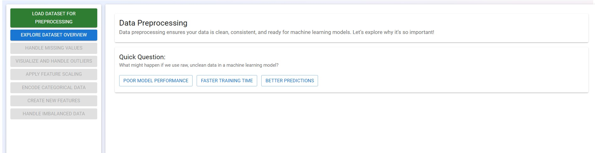

<strong>Step 2:</strong> Click on the <strong>"Show Dataset"</strong> button to display the dataset. Hover over the dataset table to identify potential issues such as missing values, outliers, or inconsistencies.

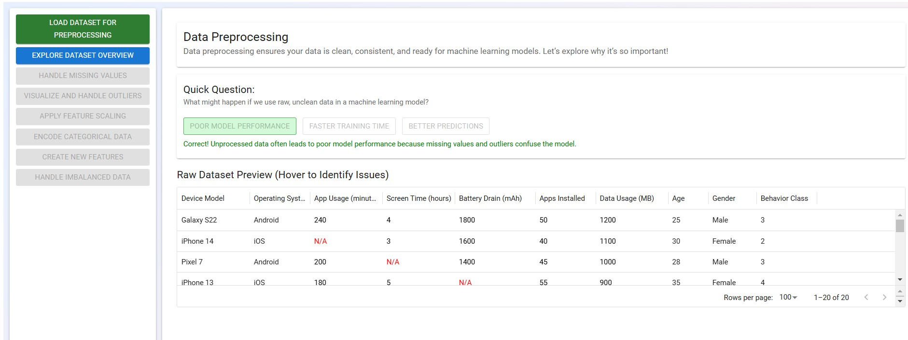

<strong>Step 3:</strong> Click on the <strong>"Explore Dataset Overview"</strong> button to examine missing values. The first step in data preprocessing is to observe the dataset and identify any missing values.

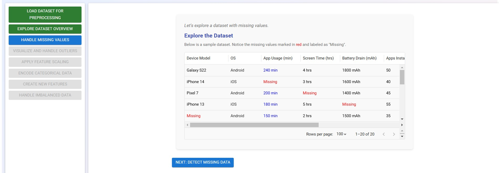

Click on the <strong>"Detect Missing Data"</strong> button to identify missing values in the dataset using Python’s <code>isnull()</code> and <code>sum()</code> methods.

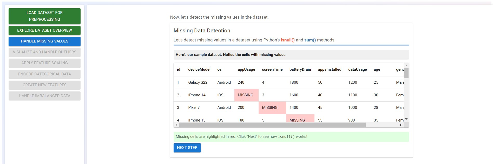

Click on <strong>"Next"</strong> to learn how the <code>isnull()</code> method works!

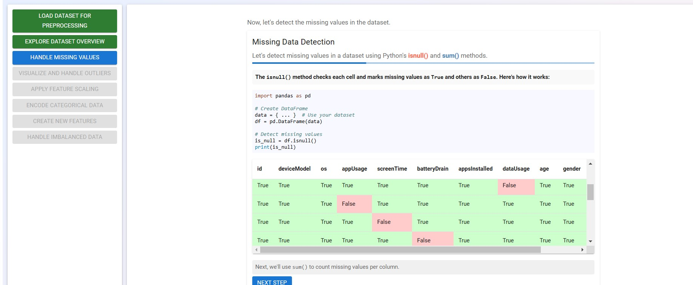

Click on the <strong>"Next"</strong> button to see how we can use the <code>code>sum()</code> method to count the missing values per column.

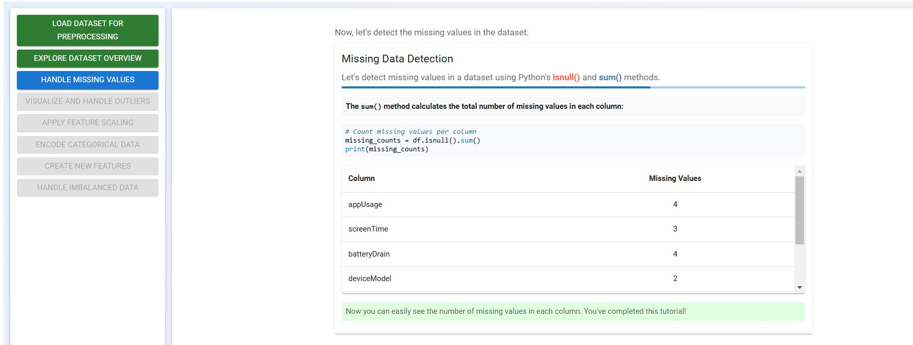

<strong>Congratulations!</strong> You've completed this tutorial and successfully finished the first step in data preprocessing!

Click on the <strong>"Handle Missing Values"</strong> button from the main options on the left side to proceed.

Choose one of the methods below to handle the missing values in the dataset:

<ul>
  <li>Mean/Median Imputation</li>
  <li>Forward Fill / Backward Fill</li>
  <li>Remove Rows/Columns with Missing Values</li>
</ul>
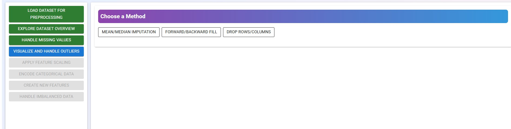

Click on the <strong>"Mean/Median Imputation"</strong> button to observe and understand how the method works.

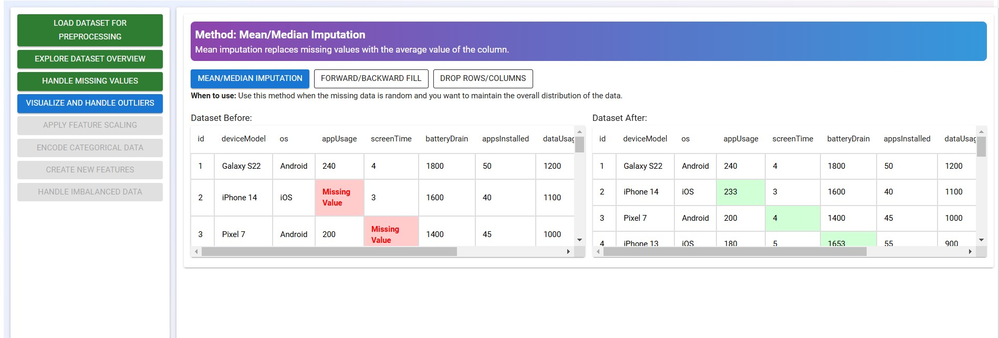

Click on the <strong>"Forward Fill"</strong>, <strong>"Backward Fill"</strong>, and <strong>"Remove Rows/Columns"</strong> options to view and understand how each method works.

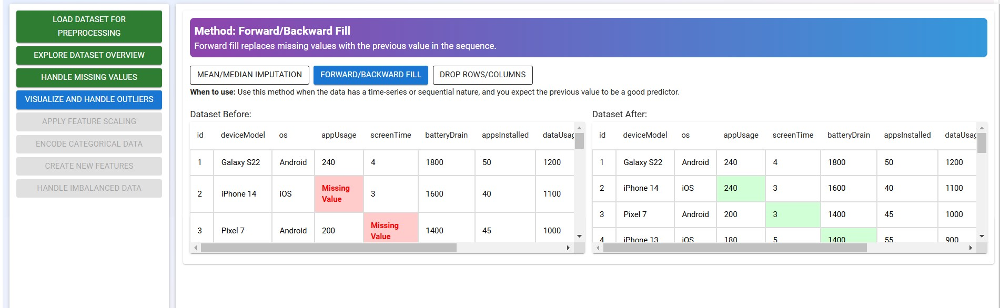
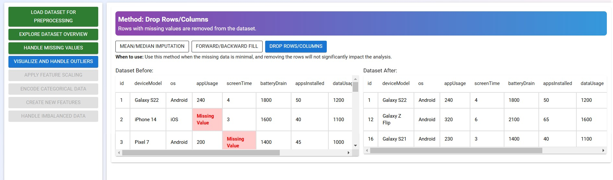

<strong>Well done!</strong> You've successfully completed this tutorial and finished the second step in data preprocessing!

Click on the <strong>"Visualize and Handle Outliers"</strong> button to proceed to the next step in data preprocessing.

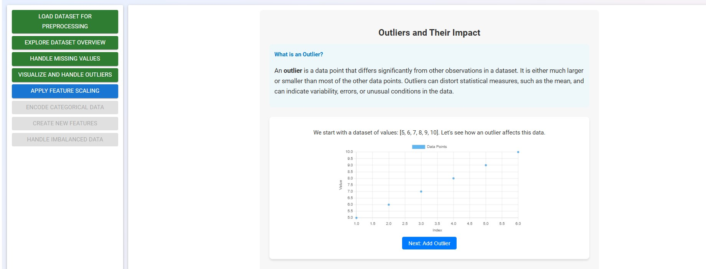

Carefully review the section to understand what <strong>outliers</strong> are and how they can impact the dataset.

Click on the <strong>"Add Outlier"</strong> button to proceed.

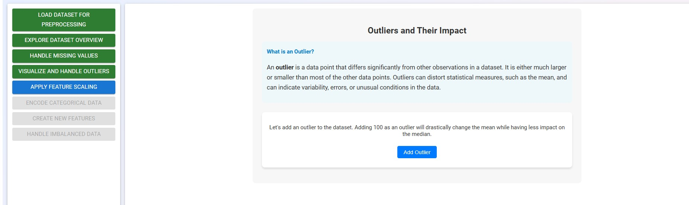
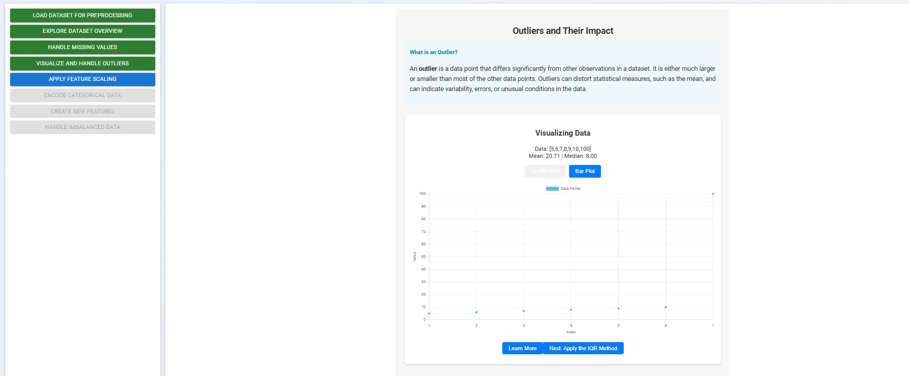

Click on the <strong>"Learn More"</strong> button to understand the impact of outliers on the dataset.

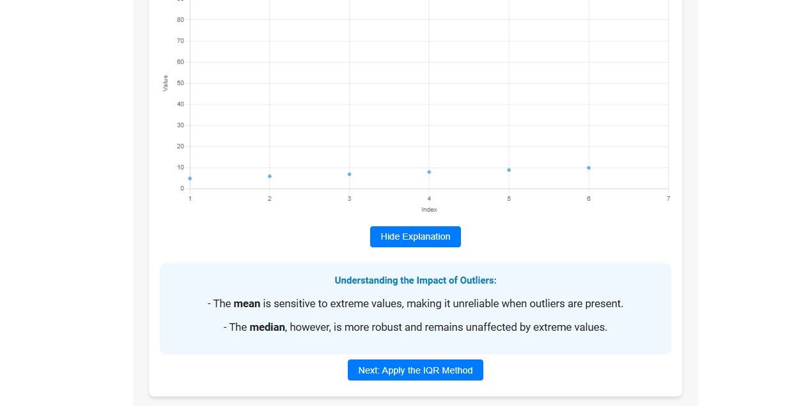

Click on the <strong>"Apply IQR"</strong> button to learn how to apply the Interquartile Range (IQR) method for detecting outliers in the preprocessed data.

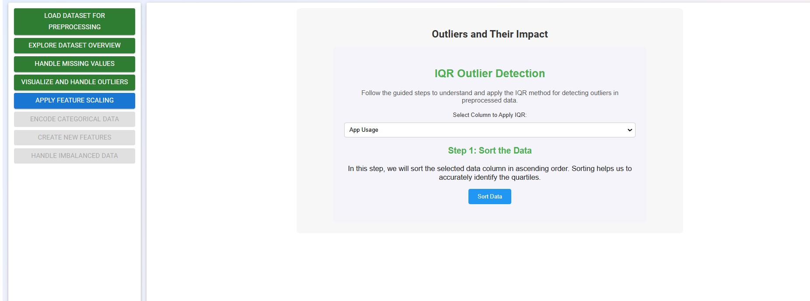

Follow the guided steps to understand and apply the IQR method for detecting and handling outliers in preprocessed data.

Similarly, explore the remaining steps in data preprocessing (feature scaling, encoding, feature engineering, etc.) and understand their importance in the machine learning pipeline.
